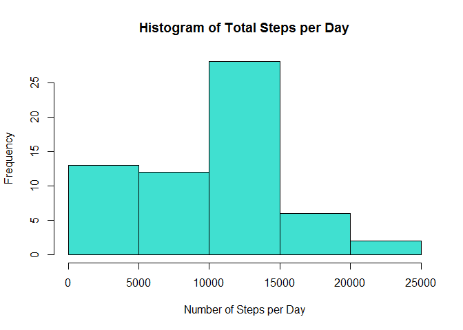
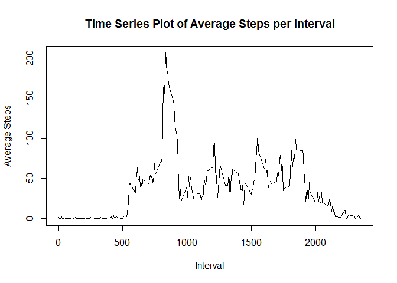
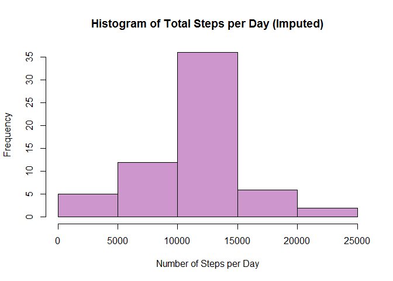
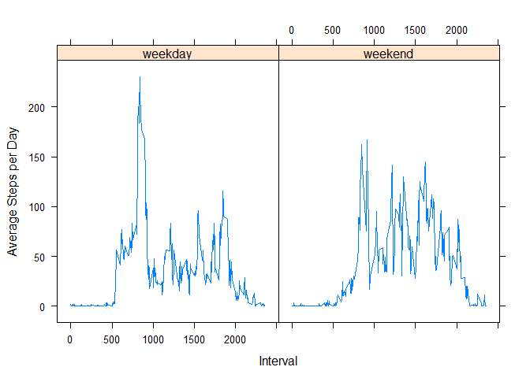

# Reproducible Research: Peer Assessment 1

The goal of this assignment is to explore activity monitoring data, writing up the results in an R Markdown document so that everything is reproducible. The activity data comes from a personal activity monitoring device. This device collects data at 5 minute intervals through out the day. The data consists of two months of data from an anonymous individual collected during the months of October and November, 2012 and include the number of steps taken in 5 minute intervals each day.


## Loading and preprocessing the data
1. Load the data (i.e. read.csv())  
The code below reads in the activity data for analysis. 

```r
setwd("C:/Users/Kimberly/My Documents/Data Science Specialization/Reproducible Research/RepData_PeerAssessment1")
activity = read.csv("activity.csv", colClasses = c("numeric", "character", "numeric"))
```

2. Process/transform the data (if necessary) into a format suitable for your analysis  
The following code reformats the date field into an easier to use date format. 

```r
library(lubridate)
```

```
## Warning: package 'lubridate' was built under R version 3.2.5
```

```
## 
## Attaching package: 'lubridate'
```

```
## The following object is masked from 'package:base':
## 
##     date
```

```r
activity$date = ymd(activity$date)
```


## What is mean total number of steps taken per day?
For this part of the assignment, you can ignore the missing values in the dataset.

1. Calculate the total number of steps taken per day  
This code calculates the total number of steps taken each day, outputting the table with each date and its respective total.

```r
daily_totals = aggregate(activity$steps, by = list(activity$date), FUN = sum, na.rm = T)
names(daily_totals) = c("date", "nsteps")
daily_totals
```

```
##          date nsteps
## 1  2012-10-01      0
## 2  2012-10-02    126
## 3  2012-10-03  11352
## 4  2012-10-04  12116
## 5  2012-10-05  13294
## 6  2012-10-06  15420
## 7  2012-10-07  11015
## 8  2012-10-08      0
## 9  2012-10-09  12811
## 10 2012-10-10   9900
## 11 2012-10-11  10304
## 12 2012-10-12  17382
## 13 2012-10-13  12426
## 14 2012-10-14  15098
## 15 2012-10-15  10139
## 16 2012-10-16  15084
## 17 2012-10-17  13452
## 18 2012-10-18  10056
## 19 2012-10-19  11829
## 20 2012-10-20  10395
## 21 2012-10-21   8821
## 22 2012-10-22  13460
## 23 2012-10-23   8918
## 24 2012-10-24   8355
## 25 2012-10-25   2492
## 26 2012-10-26   6778
## 27 2012-10-27  10119
## 28 2012-10-28  11458
## 29 2012-10-29   5018
## 30 2012-10-30   9819
## 31 2012-10-31  15414
## 32 2012-11-01      0
## 33 2012-11-02  10600
## 34 2012-11-03  10571
## 35 2012-11-04      0
## 36 2012-11-05  10439
## 37 2012-11-06   8334
## 38 2012-11-07  12883
## 39 2012-11-08   3219
## 40 2012-11-09      0
## 41 2012-11-10      0
## 42 2012-11-11  12608
## 43 2012-11-12  10765
## 44 2012-11-13   7336
## 45 2012-11-14      0
## 46 2012-11-15     41
## 47 2012-11-16   5441
## 48 2012-11-17  14339
## 49 2012-11-18  15110
## 50 2012-11-19   8841
## 51 2012-11-20   4472
## 52 2012-11-21  12787
## 53 2012-11-22  20427
## 54 2012-11-23  21194
## 55 2012-11-24  14478
## 56 2012-11-25  11834
## 57 2012-11-26  11162
## 58 2012-11-27  13646
## 59 2012-11-28  10183
## 60 2012-11-29   7047
## 61 2012-11-30      0
```

2. If you do not understand the difference between a histogram and a barplot, research the difference between them. Make a histogram of the total number of steps taken each day  
This code ouputs the required histogram.

```r
hist(daily_totals$nsteps, col = "turquoise", main = "Histogram of Total Steps per Day", xlab = "Number of Steps per Day")
```

<!-- -->

3. Calculate and report the mean and median of the total number of steps taken per day

```r
mean(daily_totals$nsteps, na.rm = T)
```

```
## [1] 9354.23
```

```r
median(daily_totals$nsteps, na.rm = T)
```

```
## [1] 10395
```


## What is the average daily activity pattern?
1. Make a time series plot (i.e. type = "l") of the 5-minute interval (x-axis) and the average number of steps taken, averaged across all days (y-axis)  
The code below first aggregates the data by taking the average number of steps per interval. Then it outputs a time series plot of the data.

```r
interval_avgs = aggregate(activity$steps, by = list(activity$interval), FUN = mean, na.rm = T)
names(interval_avgs) = c("interval", "avgsteps")
plot(x  = interval_avgs$interval, y = interval_avgs$avgsteps, type = "l", main = "Time Series Plot of Average Steps per Interval", xlab = "Interval", ylab = "Average Steps")
```

<!-- -->

2. Which 5-minute interval, on average across all the days in the dataset, contains the maximum number of steps?

```r
max = interval_avgs[interval_avgs$avgsteps == max(interval_avgs$avgsteps), c("interval")]
max
```

```
## [1] 835
```


## Imputing missing values
Note that there are a number of days/intervals where there are missing values (coded as NA). The presence of missing days may introduce bias into some calculations or summaries of the data.

1. Calculate and report the total number of missing values in the dataset (i.e. the total number of rows with NAs)  

```r
nrow(activity[!complete.cases(activity),])
```

```
## [1] 2304
```

2. Devise a strategy for filling in all of the missing values in the dataset. The strategy does not need to be sophisticated. For example, you could use the mean/median for that day, or the mean for that 5-minute interval, etc.    
To fill in missing values, I'm going to use the overall average for that 5-minute timeframe.     

3. Create a new dataset that is equal to the original dataset but with the missing data filled in.  
To to this, the code below merges the original activity file with the averages per interval by the interval columns. It then fills in the missing values with the average column value, deleting the extra column when complete. 

```r
act_new = merge(activity, interval_avgs, by.x = c("interval"), by.y = c("interval"), all.x = T)
act_new = transform(act_new, steps = ifelse(is.na(steps), avgsteps, steps))
act_new$avgsteps = NULL
head(act_new)
```

```
##   interval    steps       date
## 1        0 1.716981 2012-10-01
## 2        0 0.000000 2012-11-23
## 3        0 0.000000 2012-10-28
## 4        0 0.000000 2012-11-06
## 5        0 0.000000 2012-11-24
## 6        0 0.000000 2012-11-15
```

4. Make a histogram of the total number of steps taken each day and Calculate and report the mean and median total number of steps taken per day. Do these values differ from the estimates from the first part of the assignment? What is the impact of imputing missing data on the estimates of the total daily number of steps?

```r
new_daily_totals = aggregate(act_new$steps, by = list(act_new$date), FUN = sum)
names(new_daily_totals) = c("date", "nsteps")
hist(new_daily_totals$nsteps, col = "plum3", main = "Histogram of Total Steps per Day (Imputed)", xlab = "Number of Steps per Day")
```

<!-- -->

```r
mean(new_daily_totals$nsteps)
```

```
## [1] 10766.19
```

```r
median(new_daily_totals$nsteps)
```

```
## [1] 10766.19
```
Imputing missing data significantly increases the estimated daily average and median steps. Imputing missing values likely made up for the days or times when the subject forgot to wear his or her activity tracking device, making the estimates more accurate.  

## Are there differences in activity patterns between weekdays and weekends?
For this part the weekdays() function may be of some help here. Use the dataset with the filled-in missing values for this part.

1. Create a new factor variable in the dataset with two levels - "weekday" and "weekend" indicating whether a given date is a weekday or weekend day.

```r
act_new$weekday = ifelse(wday(act_new$date) == 1 | wday(act_new$date) == 7, "weekend", "weekday")
act_new$weekday = as.factor(act_new$weekday)
```

2. Make a panel plot containing a time series plot (i.e. type = "l") of the 5-minute interval (x-axis) and the average number of steps taken, averaged across all weekday days or weekend days (y-axis). See the README file in the GitHub repository to see an example of what this plot should look like using simulated data.

```r
new_interval_avgs = aggregate(act_new$steps, by = list(act_new$interval, act_new$weekday), FUN = mean)
names(new_interval_avgs) = c("interval", "weekday", "avgsteps")

library(lattice)
xyplot(avgsteps ~ interval|weekday, data = new_interval_avgs, type = "l", xlab = "Interval", ylab = "Average Steps per Day")
```

<!-- -->
